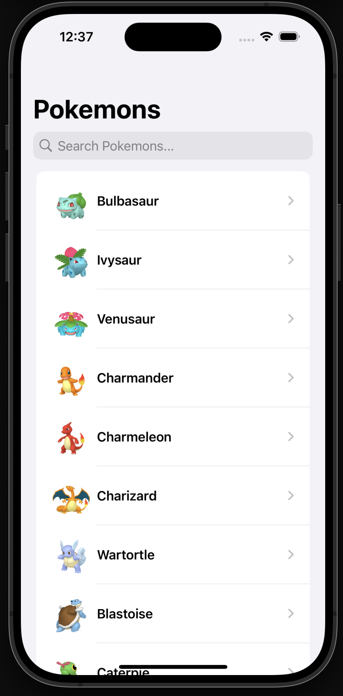
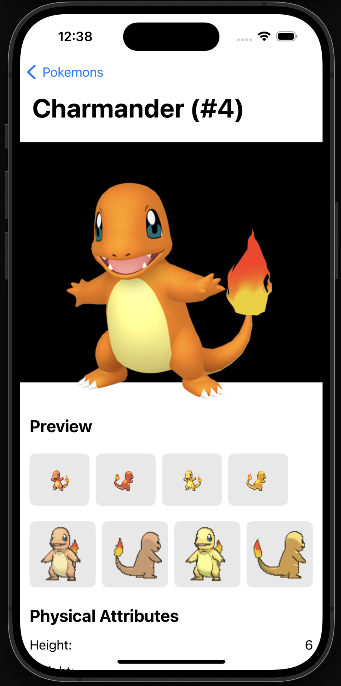
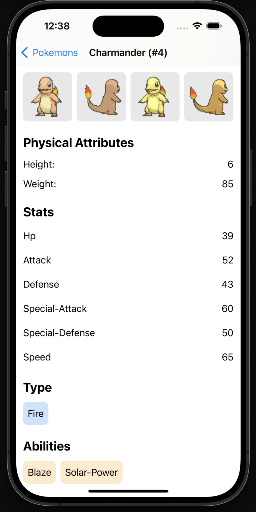

# VIPER Architecture in Swift (Using Pokemon API)

## Overview
This is a learning project where will explain how the VIPER architecture is implemented in the SwiftUI with the help of Pokemon API.

VIPER (View, Interactor, Presenter, Entity, Router) is a clean architecture pattern that separates concerns into different layers, making the code more modular and testable. While VIPER is commonly used in UIKit-based iOS apps, it can also be implemented in SwiftUI with some modifications.


## **Understanding VIPER Components**


1. **View : (PokemonListView & PokemonDetailsView)**  
   - Displays UI elements.
   - Sends user interactions to the Presenter.
   - Receives data from the Presenter to update the UI.

2. **Interactor : (PokemonListInteractor.swift)**  
   - Handles business logic and interacts with data sources (API, database, etc.).
   - Calls relevant functions in the Entity layer.
   - Passes results back to the Presenter.

3. **Presenter : (PokemonListPresenter)**  
   - Acts as a middleman between the View and Interactor.
   - Processes data received from the Interactor and formats it for display.
   - Passes UI events from the View to the Interactor.

4. **Entity : (Pokemon Models)**  
   - Defines data models (structs, classes).
   - Does not contain business logic.

5. **Router : (PokemonListRouter)**  
   - Manages navigation and screen transitions.
    - `PokemonListRouter.createModule()` sets up dependencies and returns the view with dependencies injected.


## Alamofire & Network Calls

This app uses `Alamofire` to handle networking. The `PokemonListInteractor` is responsible for making API requests to the PokeAPI and retrieving Pokémon data.

- `fetchPokemons()`: Fetches a list of Pokémon.
- `fetchPokemonDetails(for: String, completion: (Result<PokemonWithImage, Error>) -> Void)` fetches details for an individual Pokémon.

Alamofire is used for API calls:
```swift
AF.request(pokemon.url)
    .validate()
    .responseDecodable(of: PokemonDetails.self) { response in
        switch response.result {
        case .success(let details):
            let pokemonWithDetails = PokemonWithImage(name: details.name, imageURL: details.sprites.frontDefault, pokemonDetails: details)
            completion(.success(pokemonWithImage))
        case .failure(let error):
            completion(.failure(error))
        }
    }
```
This handles JSON responses from the Pokémon API and maps them to the `PokemonDetails` model.

## Demo
|Home|Details Page| Details Page|
|---|---|---|
||||

## Conclusion
This project follows the **VIPER architecture**, separating responsibilities into View, Interactor, Presenter, Entity, and Router. The usage of `Alamofire` helps streamline API calls, and SwiftUI provides a reactive UI. The modular nature of VIPER makes it easier to test, scale, and maintain this application.
